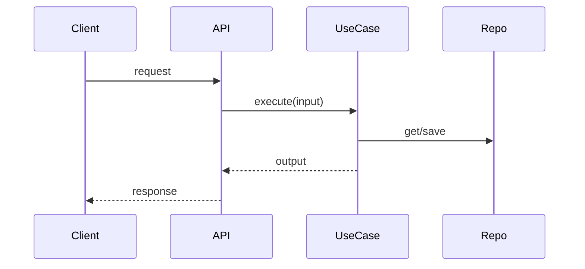

## Title
<!-- Imperative + outcome-focused. Example: "Add financing plan calculation use case" -->

## Context
<!-- What problem are we solving and why now? Link issues/docs if relevant. -->

## Scope
**In-scope**
- 

**Out-of-scope**
- 

## Acceptance Criteria
- [ ] 
- [ ] 

## Business Rules
<!-- Domain invariants / decisions that must remain true -->
- 
- 

## Design & Decisions
### Clean Architecture placement
- **Domain:**  
- **UseCases:**  
- **Adapters / Interfaces:**  

### Patterns used (call out explicitly)
- **Pattern:**  
  **Where:**  
  **Why:**  
  **Tradeoffs:**  

## Flow (optional)
<!-- Use Mermaid only when it truly helps -->

## Testing

### Added
- 

### Not added (and why)
- 

## CI / Checklist
- [ ] Tests added/updated (UseCases + business rules covered)
- [ ] CI green (lint/format/tests)
- [ ] No unrelated refactors included
- [ ] README/docs updated if contract/usage changed

## Compatibility / Rollout
- Backward compatible? yes/no
- Config/env changes:
- Migrations:

## Risks & Mitigations
- Risk:
- Mitigation:

## Notes / Follow-ups
- Future work:
- Known limitations: