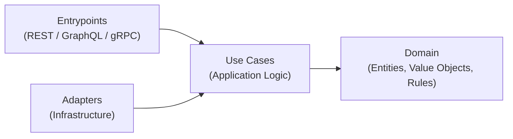

# kavak-lite

Clean Architecture, SOLID principles, explicit use cases, and multiple API styles (REST, GraphQL, gRPC).

---

## Requirements

- Docker  
- Docker Compose  

No local Python installation is required.

---

## Development Environment

This project is **Docker-first** and integrates seamlessly with **[VSCode Dev Containers](https://code.visualstudio.com/docs/devcontainers/containers)**.

When using VSCode with the *Dev Containers* extension:

- The editor attaches directly to the running container
- Python, dependencies, linters, and type checkers run inside Docker
- IntelliSense, imports, and diagnostics reflect the real runtime environment
- No local virtual environments or package installs are needed

This guarantees zero drift between editor, tests, and runtime behavior.

---

## Architecture

The codebase follows **Clean Architecture**, with strict dependency direction and explicit boundaries.



### Structure

```text
src/kavak_lite/
  domain/        # Pure business rules (no frameworks)
  use_cases/     # Application logic (orchestration)
  adapters/      # Infrastructure implementations
  entrypoints/   # Delivery mechanisms (HTTP, GraphQL, gRPC)
```

### Architectural Rules

- Domain depends on nothing
- Use cases depend only on domain
- Adapters depend on use cases
- Entrypoints depend on use cases and adapters
- Frameworks never leak inward

---

## Commands

All commands run **inside Docker** via `docker compose`.  
The `Makefile` provides a consistent and ergonomic interface.

| Command | Description |
|------|------------|
| `make build` | Build Docker images |
| `make up` | Start the API (foreground) |
| `make down` | Stop services |
| `make logs` | Tail container logs |
| `make ps` | Show running containers |
| `make sh` | Open a shell inside the API container |
| `make lock` | Generate or update `uv.lock` |
| `make sync` | Install dependencies from lockfile (frozen) |
| `make test` | Run test suite |
| `make lint` | Run Ruff checks |
| `make lint_fix` | Run Ruff checks and fix |
| `make fmt` | Auto-format with Ruff |
| `make typecheck` | Run MyPy (strict) |
| `make check` | Run lint + typecheck + tests |
| `make clean` | Remove containers and volumes |

---

## Dependency Management

Dependencies are managed with **[uv](https://docs.astral.sh/uv/)** and fully locked.

Workflow:

```bash
make lock
make sync
git add pyproject.toml uv.lock
git commit -m "deps: update dependencies"
```

All environments (local, CI, production) install dependencies strictly from the lockfile.
